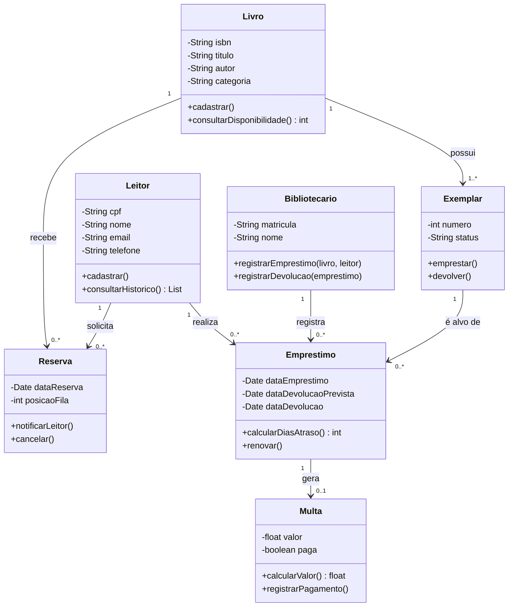
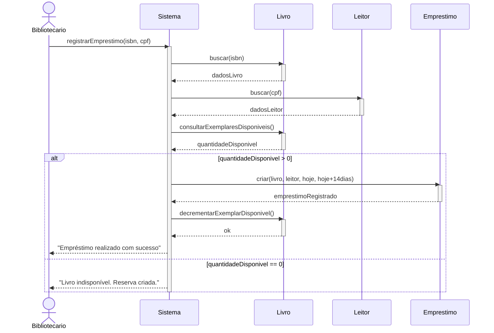
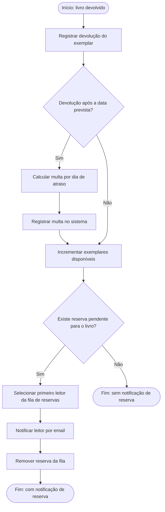

# Modelagem UML — Sistema BiblioTech

## a) Diagrama de Classes

**Notas de modelagem:**
- `Livro` e `Exemplar` são separados porque um mesmo título pode ter vários exemplares físicos, cada um com seu próprio status (disponível/emprestado).
- `Emprestimo` está associado a um `Exemplar` específico (não apenas ao `Livro`), pois é o exemplar físico que efetivamente é emprestado.
- A multiplicidade `0..1` entre `Emprestimo` e `Multa` reflete que nem todo empréstimo gera multa (só os devolvidos com atraso).

---

## b) Diagrama de Sequência — "Realizar empréstimo de um livro"

---

## c) Diagrama de Atividades — "Devolver livro e processar reservas"

**Leitura do fluxo:** o caminho `CalcAtraso` cobre os dois estados finais em relação à multa (com/sem multa), e o caminho `VerifReserva` cobre os dois estados finais em relação à notificação (com/sem notificação) — as quatro combinações possíveis (com multa + com notificação, com multa + sem notificação, sem multa + com notificação, sem multa + sem notificação) são alcançáveis combinando os dois desvios.
